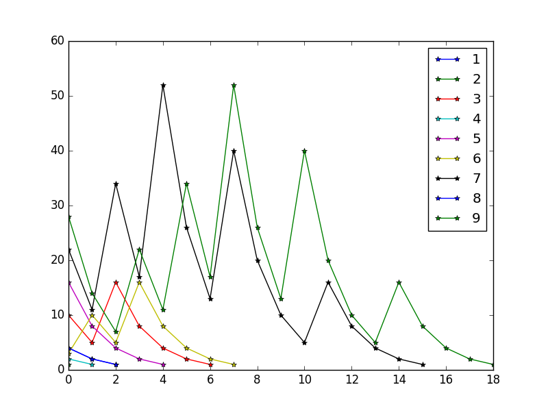

# Collatz Conjecture Simulation
Plots the path of various seeds

## Algorithm
```
1. choose a number
2. if number is 1 => goto 6
3. if it is odd => multiply by 3 and add 1.
4. if it is even => divide by 2.
5. goto 2
6. // Finished
```

## Usage

```bash
$ python3 Collatz_conjecture.py
```

## Example
